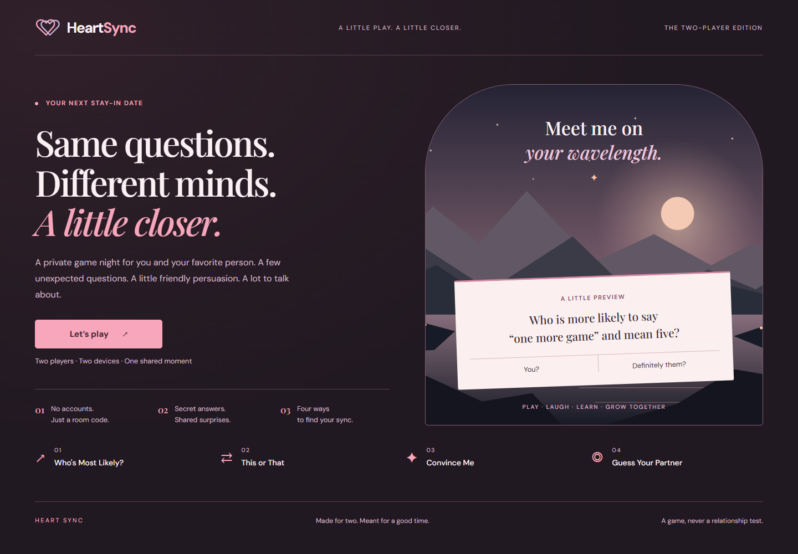
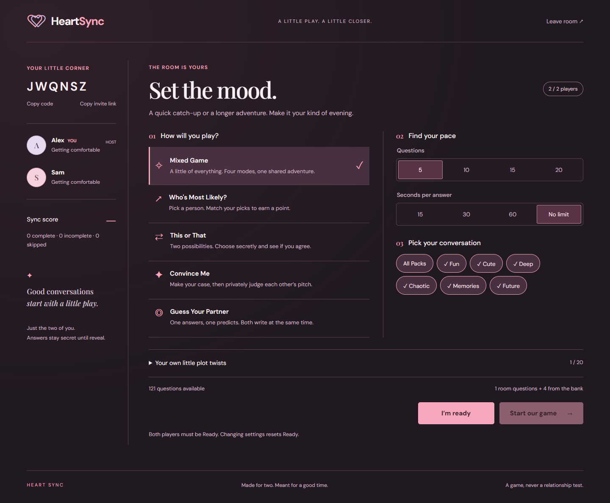

# Heart Sync: visual review

Review branch: `codex/heart-sync-visual-polish`, based on updated `main` at `4a5037c`. Production remains unchanged until this PR is reviewed and merged.

## Findings and direction

The baseline browser walkthrough covered home, creation, joining, the lobby, all four modes, answer locking, revelation, evaluation, reconnecting, results and replay. The main issues were small supporting text, a blue-dominated palette, repetitive rounded panels, a tall desktop lobby, weak separation between answering and revelation, and a misleading “Ready to continue” status after the game had finished.

The original reference inspired the sunset, paired hearts, pink/lavender player identities and intimate tone. The existing illustration and locally hosted fonts are retained. No new assets, dependencies or external font services are required.

The review used the toolkit's [frontend-patterns](https://github.com/wzzzodiac/Codex/blob/main/skills/frontend-patterns/SKILL.md) and [e2e-testing](https://github.com/wzzzodiac/Codex/blob/main/skills/e2e-testing/SKILL.md) workflows: establish the current behavior, choose a coherent visual direction, preserve existing state ownership, then inspect actual browser evidence at representative widths.

## Concrete changes

- **Typography:** Playfair Display gives questions and major headings a distinctive voice; DM Sans remains the readable interface face. Supporting copy is generally 12–15px instead of the previous 8–11px range. Player names and statuses wrap naturally.
- **Palette:** warm plum surrounds a blush question surface with dark text. Pink identifies actions, lavender/rose distinguish players, and burgundy buttons anchor actions on the light surface. Calculated contrast for the principal text/background pairs: question body 11.64:1, question helper text 5.70:1, dark-page helper text 9.19:1, pink primary button 7.40:1, burgundy question button 7.28:1. These checks do not constitute a full accessibility audit.
- **Composition:** the desktop lobby puts mode selection beside pace/packs. Mode choices are separated rows with a selected accent rail. Results place a large score beside readable statistics. Below the desktop breakpoint, content reflows into stacked sections.
- **Personality:** a slightly tilted question postcard sits over the original sunset. Paired initials, serif italics and a few connection marks carry the romantic identity without adding decoration to every surface.
- **Interaction:** submitted text sits in a distinct waiting panel naming the partner; revealed answers become separate paper cards; the reconnect countdown has clear emphasis; completed players now say “Game complete.” These are presentation changes to existing server states.
- **Accessibility:** 3px visible focus, a dark focus ring on light surfaces, 44px minimum interactive button targets, 50px text fields, wrapping long content and `prefers-reduced-motion` support.

## Before and after

| Screen        | Before                                                 | After                                                           |
| ------------- | ------------------------------------------------------ | --------------------------------------------------------------- |
| Home, 1440px  | [Baseline](review/visual-polish/before-home-1440.png)  | [Warm palette and postcard](review/visual-polish/home-1440.png) |
| Lobby, 1440px | [Baseline](review/visual-polish/before-lobby-1440.png) | [Two-column setup](review/visual-polish/lobby-1440.png)         |

Additional evidence:

| Screen                    | Screenshot                                                                            |
| ------------------------- | ------------------------------------------------------------------------------------- |
| Home, 360px               | [Mobile introduction](review/visual-polish/home-360.png)                              |
| Join, 390px               | [Fields and visible focus](review/visual-polish/join-390.png)                         |
| Who's Most Likely?, 390px | [Simultaneous player choices](review/visual-polish/answer-Who-s-Most-Likely-390.png)  |
| This or That, 1440px      | [Two choices](review/visual-polish/answer-This-or-That-1440.png)                      |
| Convince Me, 360px        | [Reveal and evaluation](review/visual-polish/evaluate-Convince-Me-360.png)            |
| Guess Your Partner, 768px | [Roles and evaluation wait](review/visual-polish/evaluate-Guess-Your-Partner-768.png) |
| Submitted, 390px          | [Private answer and partner wait](review/visual-polish/submitted-390.png)             |
| Disconnected, 390px       | [Paused game and reconnection countdown](review/visual-polish/paused-390.png)         |
| Results, 1920px           | [Score and mode statistics](review/visual-polish/results-1920.png)                    |

## Validation

- `npm run build`: passed, including TypeScript and the 120-record question validator (30 per mode).
- `npm test`: 19/19 passed, including real independent Socket.IO clients, secrecy, reconnect, voting and continue barriers. An initial sandboxed invocation could not establish its WebSocket; rerunning with local sockets permitted passed.
- `npm run format:check`: passed.
- `npx playwright test --config playwright.review.config.ts`: 2/2 passed in installed Microsoft Edge on Windows. The isolated review configuration uses frontend 5175 / backend 3003 and refuses to reuse a running server. Existing deployment and default test configuration are unchanged.
- Browser matrix: **360, 390, 768, 1440 and 1920 CSS pixels** for home, create, join, lobby, every mode's question and reveal, text evaluation, submitted answers, disconnect pause and final results. No horizontal document overflow. Enabled buttons in the captured-state helper meet 44 × 44px bounds and stay within the horizontal viewport.
- Two independent browser contexts verify the same question, secret answers before both submit, reconnect after refresh/offline, evaluation, shared results, fresh Ready on replay and leaving. No uncaught page errors during that flow.
- Keyboard Tab focus and Enter activation, reduced-motion computed transition, a long player name, a long custom question, and 720 CSS-pixel reflow representing a 1440px screen at 200% were checked.
- Actual screenshots were inspected across desktop, tablet and narrow layouts, including all four modes, submitted/reveal/evaluation states, pause and results. The full regenerated matrix is saved under ignored `qa/`; representative PNGs are committed here. CI's existing `browser-evidence` artifact retains its run's full matrix for seven days. Random game questions and room codes may differ between runs.

This is browser viewport emulation, not physical phone, Safari/Firefox, native browser zoom, mobile keyboard or screen-reader certification. Captures and functional tests use local preview servers, not production.

## Scope preserved

The question JSON and catalog, server, shared types/contracts, connection client, scoring, question selection, room/reconnection mechanics, dependency manifests, Docker and deployment workflows/scripts have no changes from the base. App changes are layout wrappers, accessible grouping and state copy; socket handlers remain intact. This PR should remain unmerged for design review.
